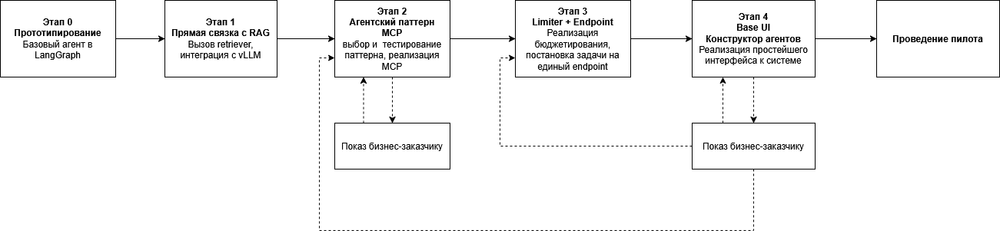

# ML System Design Doc
## Дизайн ML системы - MVP Agentic Platform

### 1. Цели и предпосылки 
#### 1.1. Зачем идем в разработку продукта?  
##### Бизнес-цель
Сокращение временных затрат на рутинные операции с неструктурированными данными, 
сложными/вариативными процессами внутри компании. 

##### Почему станет лучше, чем сейчас, от использования ML
При правильной реализации сотрудники смогут меньше тратить времени на рутинные (понятные и простые, 
но вариативные операции), больше тратить на сложные аналитические операции. В итоге должна 
повыситься производительность сотрудников.

ML в данном контексте выступает в качестве быстрого агрегатора рутинных операций, намного более быстрого и,
с некоторой вероятностью, ещё и более точного, чем человек. И если сейчас рутина
автоматизирована отдельными сценариями, использующими разнообразные ML пайплайны, то после внедрения системы
процесс будет единым с понятным выбором тулов, что снизит нагрузку на поддержку разнородных решений и 
повысит интерпретируемость нагрузки на языковую модель. Это, в свою очередь, позволит более осмысленно
подойти к вопросу про расширение инфраструктуры под AI кейсы и направления по возможной оптимизации.

##### Что будем считать успехом итерации с точки зрения бизнеса
Т.к. производится пилот и текущие сценарии уже автоматизированы, пусть и разнородно, явной бизнес-выгоды
данная итерация не несёт. Косвенная выгода - показать, что создание платформы возможно, для дальнейшего
встраивания инструмента (или реализованного на основе этого инструмента агента) в существующие решения компании.

#### 1.2. Бизнес-требования и ограничения  
##### Краткое описание БТ
Детальных БТ ещё не сформировано. Совсем коротко: продукт должен предоставлять
инструменты для создания модульных, расширяемых и совместимых с другими системами мультиагентных систем.

Текущие БТ:
 - Разработать гибридную, управляемую агентную платформу. Она должна позволять создавать агентов и рабочие
процессы, которые гармонично сочетают декларативные (правила-ориентированные) и недекларативные (адаптивные) паттерны
поведения в рамках единого, визуально управляемого интерфейса.
 - Полная поддержка Model Context Protocol (MCP) для стандартизированного и безопасного взаимодействия с
внешними инструментами, API и данными.
 - Полная поддержка Agent-to-Agent (A2A) protocol для создания масштабируемых, мультиагентных систем, способных
взаимодействовать с агентами от разных производителей.
 - Обеспечить нативную поддержку и обработку текста, изображений, аудио и видео в рамках одного агента и рабочего
процесса.
 - Встроить комплексную операбельность (observability), включающую визуализацию рабочих процессов агента,
детальное логирование каждого шага.
 - Предоставить функциональность объяснимости (explainability), позволяющую агенту автоматически указывать
источники своих выводов и ссылки на факты, на которых основаны решения.
 - Реализовать гибкие механизмы "человека в цикле" (human-in-the-loop) для ручного утверждения решений,
исправления ошибок и обучения агента в ситуациях неопределенности.
 - Обеспечить строгий контроль доступа (RBAC) и соблюдение принципов безопасности и конфиденциальности данных,
включая шифрование и аудит всех действий агента и пользователей.
 - Оптимизировать использование LLM для минимизации стоимости и задержки. Это может включать в себя
использование прямых вызовов там, где это возможно, и применение графовых архитектур, для предотвращения лишних вызовов LLM.

##### Бизнес-ограничения
Сейчас в пайплайнах токены расходуются избыточно. Использование ИИ становится дорого при любой модели - 
локальной или облачной. Т.о. существует ограничение по железу на скорость генерации.

Барьер в виде доверия к агенту, необходима прозрачность принятия решения.

##### Что мы ожидаем от пилота
Пилот должен уметь выполнять один агентский пайплайн (сценарий) - RAG, при этом он (пайп) не должен быть монолитным.
Т.е. агент в пилоте должен быть набором нод, которые могут быть соединены друг с другом произвольно,
однако гарантируется работоспособность только на сценарии RAG.

В идеале видится демонстрация в виде накидывания нод - конструирования агента, который в итоге выполняет указанный сценарий успешно.

Архитектура решения должна учитывать возможность расширения набора tools и замены точки входа на модель. В
идеальной картине мира также видится независимость от балансировщика нагрузки и менеджера бюджета токенов.

##### Описание бизнес-процесса пилота
Справедливо только для данной итерации.

Пользователь заходит в интерфейс (не специфицированный, может быть CLI или терминал), создаёт нового агента,
добавляет ему ноды, запускает агента, получает результат в виде текстовой строки.

##### Критерии успеха и возможные пути развития проекта
Критерий успеха (он же - путь развития) проекта (не итерации) - продажа агентов, созданных на платформе, в составе любого продукта 
компании минимум два раза.

#### 1.3. Что входит в скоуп итерации, что не входит
Что входит:
1. Единая точка входа - проектирование эндпоинта к системе.
2. Лимитирование - внедрение готового решения по ограничению бюджета токенов.
3. Ядро создания агентов, кастомизация нод.
4. Один MCP тул - retriever.
5. Единая точка входа в модель - интеграция с vLLM.

Что не входит:
1. Авторизация, ни в каком виде (RBAC, в том числе).
2. UI (максимум - терминал или CLI).
3. Балансировщик - звено между эндпоинтом, лимитером и системой. Максимум - проектирование точки встраивания.
4. Замена точки входа в модель (универсальный интерфейс).
5. Конструктор и хранилище промптов.
6. A2A протокол. Максимум - оценка влияния А2А совместимого решения на MVP, устранение заведомо несовместимых решений.
7. Логирование.
8. Объяснимость (explainability).
9. Human-in-the-loop.
10. Оптимизация LLM.
11. Мультимодальность.

#### 1.4. Предпосылки решения  
Существует около 18 сценариев с использованием LLM, которые выполняются разрозненно на различных инструментах.

MVP выполняется одним человеком с периодической презентацией команде. Производится регулярный архитектурный контроль от 
старшего архитектора. Бизнес-требования могут дополняться и видоизменяться в процессе.

- Не NDA часть проекта публикуется в GitHub, проект целиком находится в локальном GitLab.
- Документация - функциональная спецификация на продукт, ведётся в локальном Confluence, NDA, но может быть
предоставлена по требованию проверяющего с произведёнными правками для публичной демонстрации.
- Код - Pycharm, Python 3.12, стандартная модульность, pep8, пре-коммит чек - ruff.
- Стек: vLLM, LiteLLM, MCP, LangGraph, LangChain + стандартный для Python приложений. Возможна мультиплатформенность (Go, Java).
- DB: Postgres

### 2. Методология     

#### 2.1. Постановка задачи  
Задача конструктора агентов на максимально готовом фреймворке с поддержкой MCP и A2A. 

#### 2.2. Блок-схема решения  

#### 2.3. Этапы решения задачи
##### Этап 0 Прототипирование
- Агент с манула LangChain и LangGraph, простейшие ноды, разбор исходного кода.
Тестируется прохождение состояния через ноды, механизм выбора, обновления состояния, генерация промежуточных и новых состояний.
- Изучение протокола A2A.

##### Этап 1 Прямая связка с RAG
- Прототип обогащается прямым безусловным вызовом retriever и отправкой на генерацию. Все шаги должны фиксироваться в
передаваемых состояниях.
- Используется рабочий retriever, для публичного проекта этот тул остаётся заглушкой на точке входа.
- В качестве модели используется vLLM с рабочим развёртыванием. Для публичного проекта попытка (без гарантии) локального развёртывания vLLM.

##### Этап 2 Условная связка с RAG и MCP
- Тестируется правильный пайплайн - запрос в модель вопроса пользователя и условный вызов тулы - retriever по
результатам размышлений модели. Паттерн Reflect - Thought - Act - Observe. Выбор подходящего паттерна:
анализ статей, лучших практик langchain, текущих работ в заданной тематике, консультации со специалистами.
- Анализ влияния A2A на паттерн. Возможен промежуточный шаг со встраиванием А2А в MVP и корректировка подхода к выбору паттерна.
- Прототипирование паттерна, замер метрик из п.3.2, интеративный подход. Выбранный паттерн является Baseline решения.
- Перевод retriever на MCP Server.
- Демонстрация этапа заказчику.

##### Этап 3 Limiter + Endpoint
- Реализация LiteLLM бюджетирования и создание единого эндпоинта в систему.
- Постановка задачи на единый эндпоинт, возможно ли это. Требования к API.

##### Этап 4 Создание CLI/Terminal интерфейса для добавления агентов
- Выбор технологии отладочного интерфейса, реализация.
- Итоговое демо по проекту, сбор обратной связи, доработка по результатам. Подготовка к пилоту.

### 3. Подготовка пилота
#### 3.1. Способ оценки пилота
Работоспособность пилота оценивается визуально на контрольных вопросах заказчика, не более 10 вопросов с известным,
но не детерминированным ответом, успех воспроизводимости сценария - 80-85%.

#### 3.2. Что считаем успешным пилотом
Успехом считается работоспособный кейс:
1. Пользователь задает вопрос
2. Агент анализирует, относится ли вопрос к RAG или нет.
3. Если относится, то вытаскивает данные из RAG.
4. Если не относится, то генерирует ответ из своих данных.
  
#### 3.3. Подготовка пилота  
Ожидаемая вычислительная сложность системы не должна требовать более 1 ядра CPU, также не должна требоваться GPU.

### 4. Внедрение
На данной итерации не требуется.
